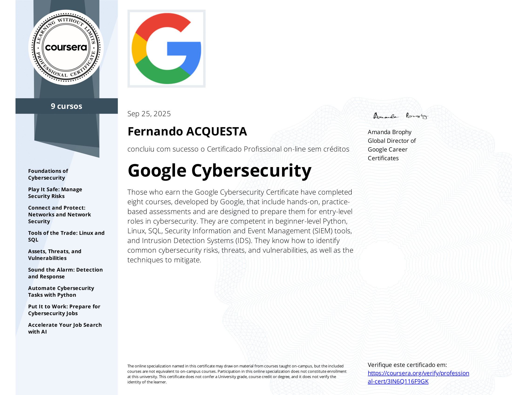
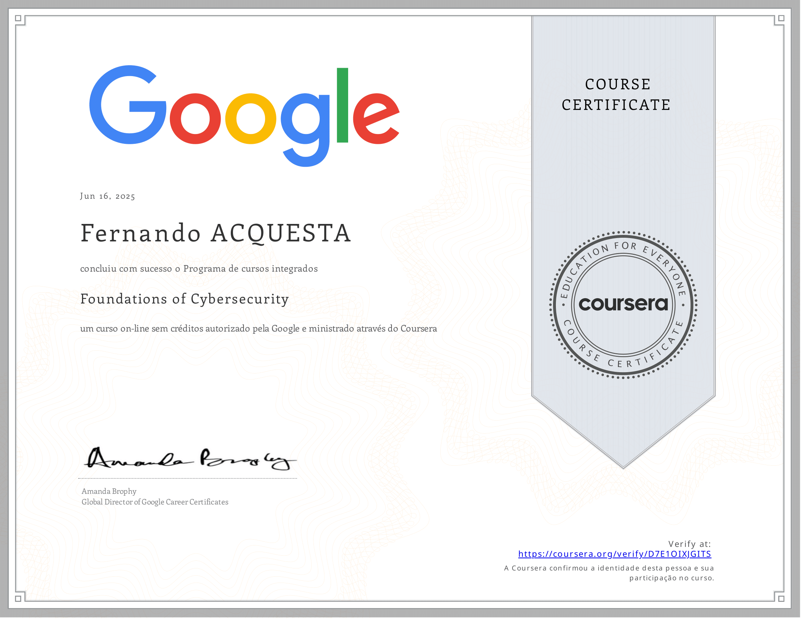
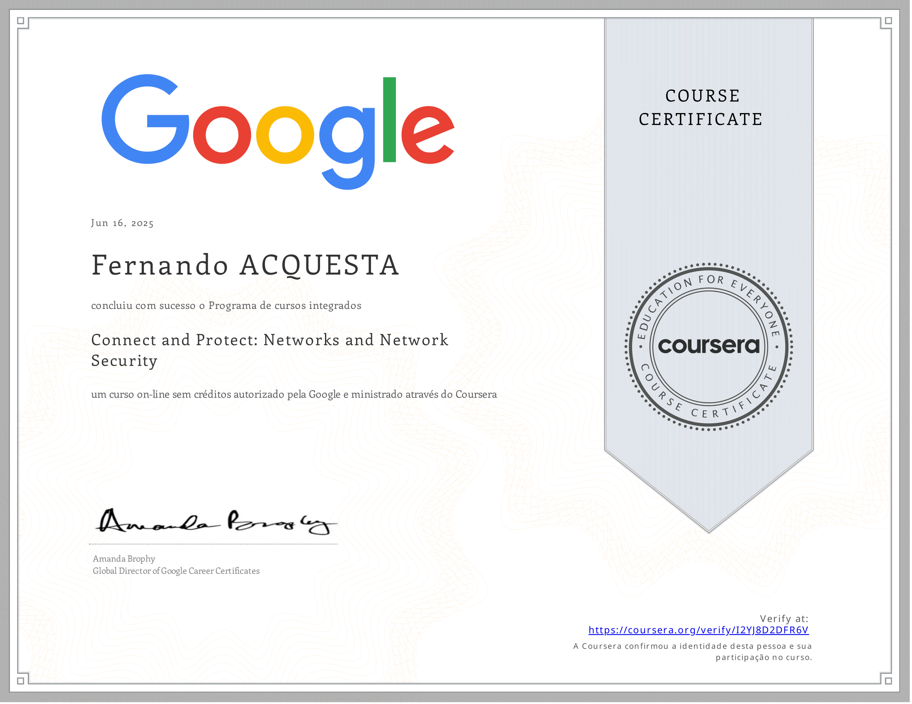
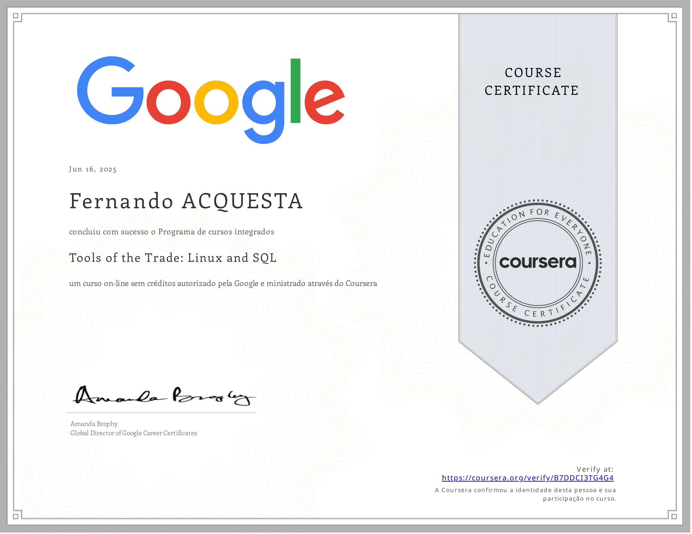
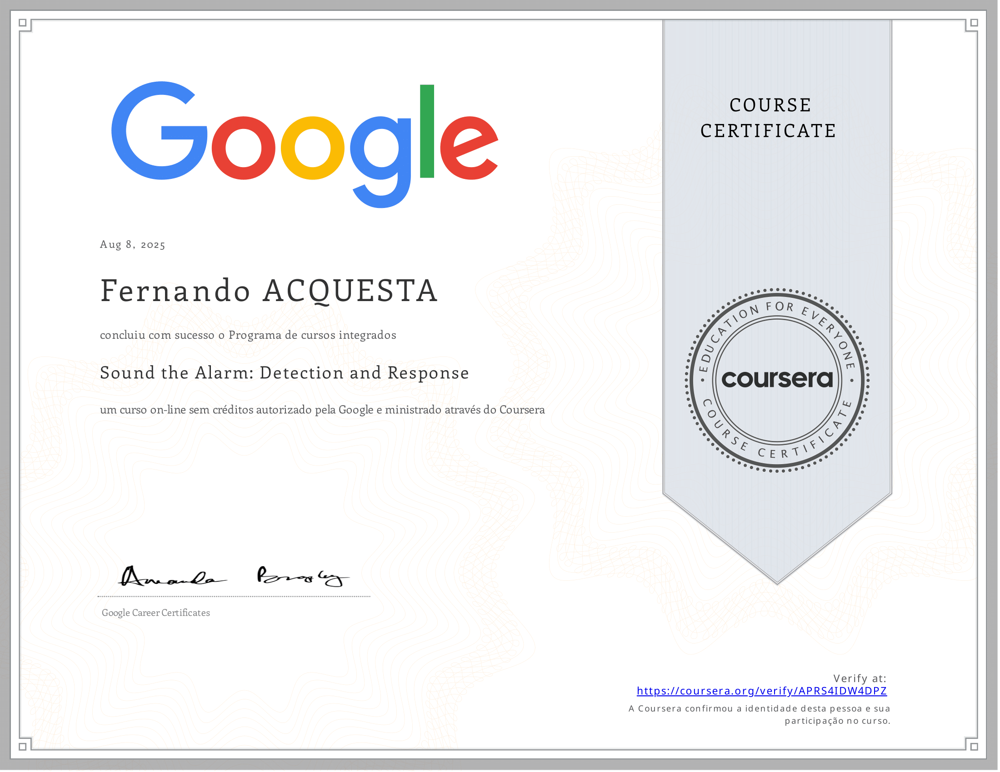
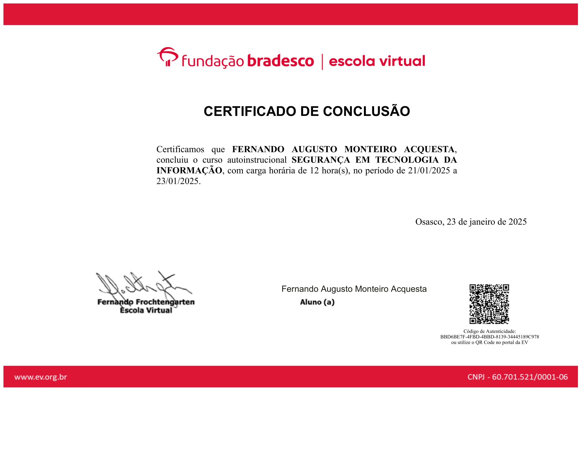
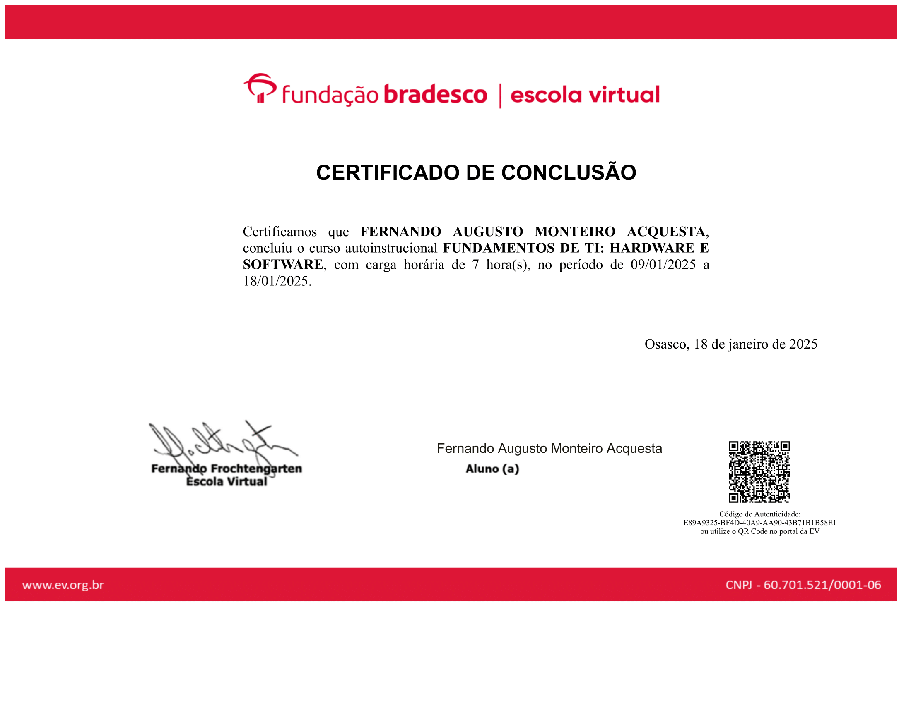

# 🔐 Portfólio de Cibersegurança | Fernando Acquesta

Bem-vindo ao meu portfólio de projetos práticos em **Cibersegurança**!  

Sou estudante de Cibersegurança com foco no desenvolvimento de habilidades técnicas voltadas para proteção de sistemas e dados.  
Tenho experiência prática em **análise de segurança, automação com Python, hardening de sistemas, análise de logs e gestão de vulnerabilidades**, aplicando metodologias reconhecidas no setor.  

Este portfólio reúne projetos que demonstram minha capacidade de aprender, aplicar conceitos e utilizar ferramentas de segurança em cenários reais.

---

## 🎯 Objetivo

Busco oportunidades como **profissional júnior em Cibersegurança**, aplicando e expandindo meus conhecimentos em ambientes reais, contribuindo para a proteção de sistemas e dados.

---

## 🛠️ Tecnologias e Ferramentas

**Linguagens de Automação/Dados:**
- Python 🐍
- Bash/Shell Script
- SQL

**Sistemas Operacionais e Ambientes:**
- Linux (Kali, Ubuntu)
- Windows
- Cloud Security

**Ferramentas Essenciais:**
- Wireshark
- Nmap
- Metasploit
- Burp Suite
- Análise de Logs (SIEM concepts)

---

## 🛡️ Competências Técnicas

- Análise de Vulnerabilidades (Vulnerability Management)
- **Hardening de Sistemas**
- Gerenciamento de Acessos
- **Inteligência de Ameaças Cibernéticas (Cyber Threat Intelligence)**
- **Resposta e Tratamento de Incidentes (CSIM)**
- Segurança de Redes (Network Security)
- Gestão de Ameaças (Threat Management)

---

## 📂 Projetos em Destaque

### 🔹 [Gerenciamento de Lista de Permissões IP](https://github.com/fernando-acq/ip-access-manager)
   Algoritmo em Python para automatizar a remoção de endereços IP não autorizados de arquivos de controle de acesso.
   - **Tecnologias:** Python, manipulação de arquivos
   - **Objetivo:** Automatizar gerenciamento de acessos restritos
   - **Status:** ✅ Completo

---

## 📜 Certificações

Aqui estão as certificações mais relevantes que comprovam meus conhecimentos em Cibersegurança:

### 🎓 Google Cybersecurity Professional Certificate (Coursera, 2025)

Conjunto de 8 cursos que compõem o programa profissional da Google:

| Curso | Status | Link |
|-------|--------|------|
| Foundations of Cybersecurity | ✅ Concluído | [Ver Certificado](./certificados/foundations-cybersecurity.pdf) |
| Play It Safe: Manage Security Risks | ✅ Concluído | [Ver Certificado](./certificados/manage-security-risks.pdf) |
| Connect and Protect: Networks and Network Security | ✅ Concluído | [Ver Certificado](./certificados/networks-security.pdf) |
| Tools of the Trade: Linux and SQL | ✅ Concluído | [Ver Certificado](./certificados/linux-sql.pdf) |
| Assets, Threats, and Vulnerabilities | ✅ Concluído | [Ver Certificado](./certificados/assets-threats-vulnerabilities.pdf) |
| Sound the Alarm: Detection and Response | ✅ Concluído | [Ver Certificado](./certificados/detection-response.pdf) |
| Automate Cybersecurity Tasks with Python | ✅ Concluído | [Ver Certificado](./certificados/automate-with-python.pdf) |
| Put It to Work: Prepare for Cybersecurity Jobs | ✅ Concluído | [Ver Certificado](./certificados/cybersecurity-jobs.pdf) |

🔗 [Ver Certificado Profissional](./certificados/google-cybersecurity-professional.pdf)

### Cursos Complementares

| Certificação | Instituição | Ano | Link |
|--------------|-------------|-----|------|
| Segurança em Tecnologia da Informação | Fundação Bradesco | 2024 | [Ver Certificado](./certificados/bradesco-seguranca-ti.pdf) |
| Lei Geral de Proteção de Dados (LGPD) | Fundação Bradesco | 2024 | [Ver Certificado](./certificados/bradesco-lgpd.pdf) |
| Fundamentos de TI: Hardware e Software | Fundação Bradesco | 2024 | [Ver Certificado](./certificados/bradesco-fundamentos-ti.pdf) |

---

📎 Visualizar Imagens dos Certificados dos Cursos de Google Cybersecurity Professional Certificate

  
  
  
  
  
  
  
  
  

📎 Visualizar Imagens dos Certificados dos Cursos Complementares

  

  
  
  

---

## 📫 Contato

- 🟦 **LinkedIn:** [fernando-acquesta-cybersecurity](https://www.linkedin.com/in/fernando-acquesta-cybersecurity)
- 📧 **Email:** fernando.acq.monteiro@gmail.com
- 🐙 **GitHub:** [@fernando-acq](https://github.com/fernando-acq)

---

## 📊 Estatísticas do GitHub

---

⭐ **Este portfólio está em constante atualização com novos projetos!**

📌 Última atualização: Setembro 2025
