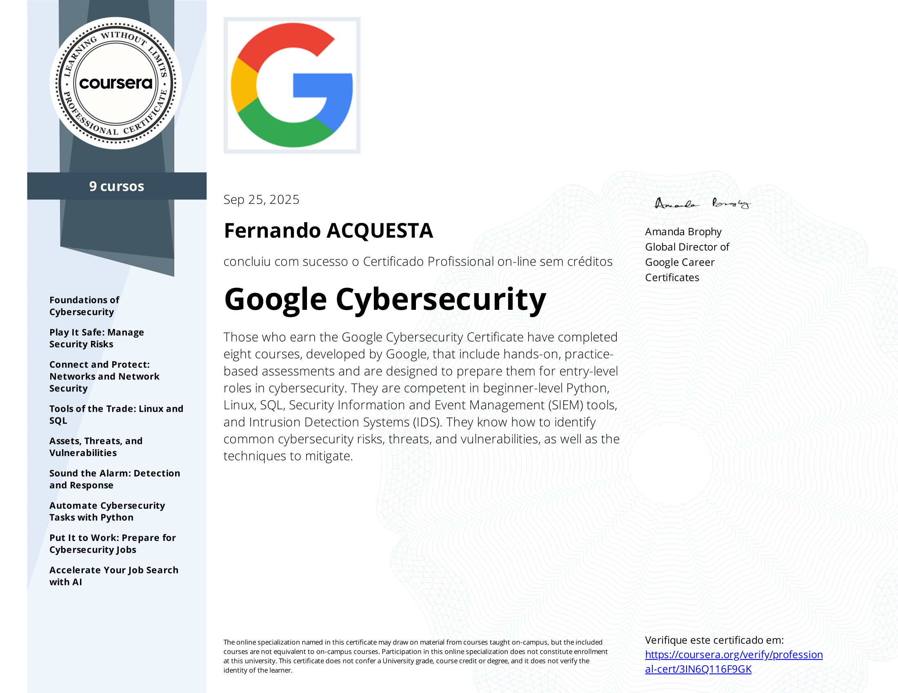
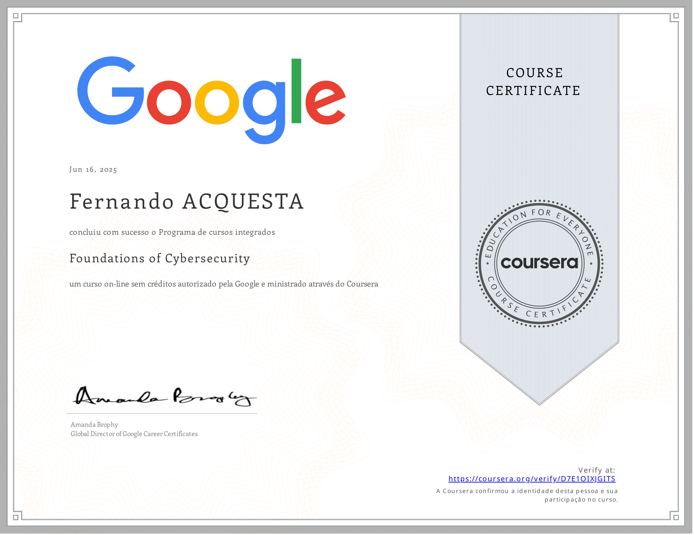
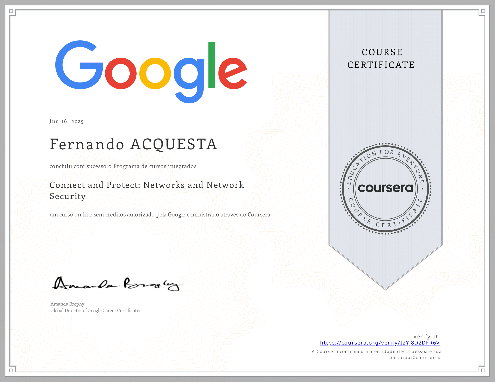
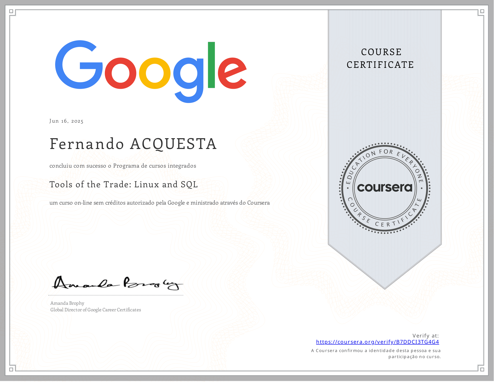
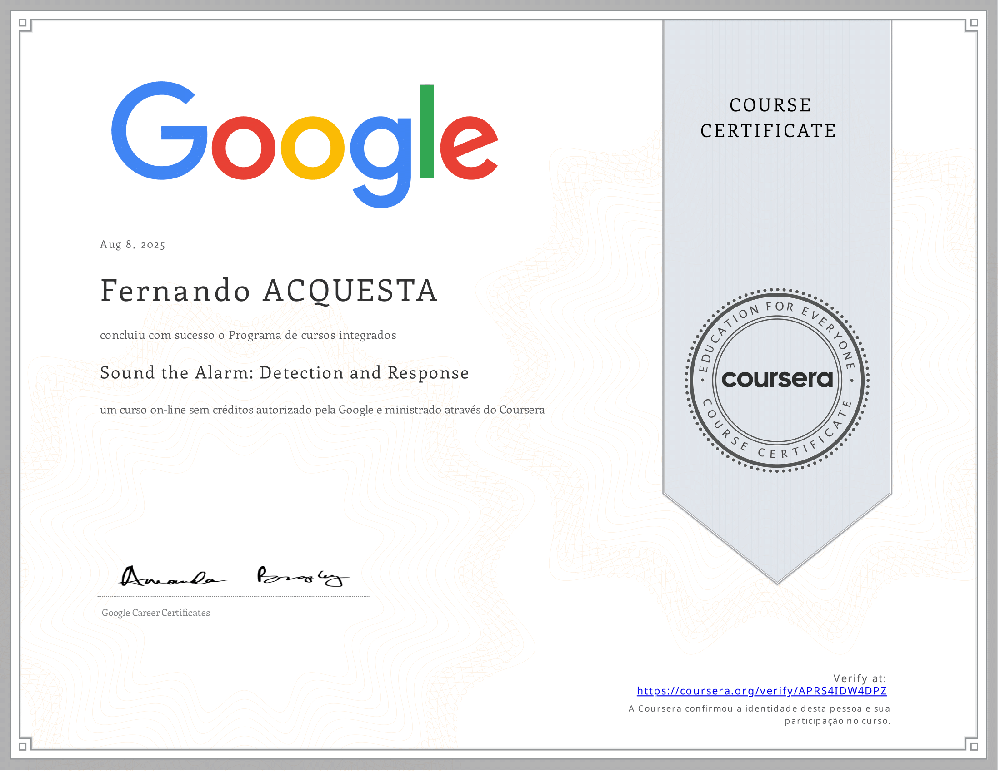
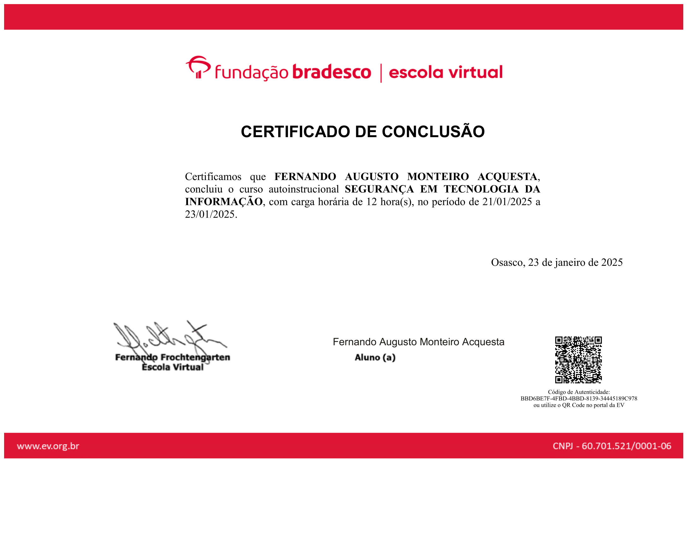
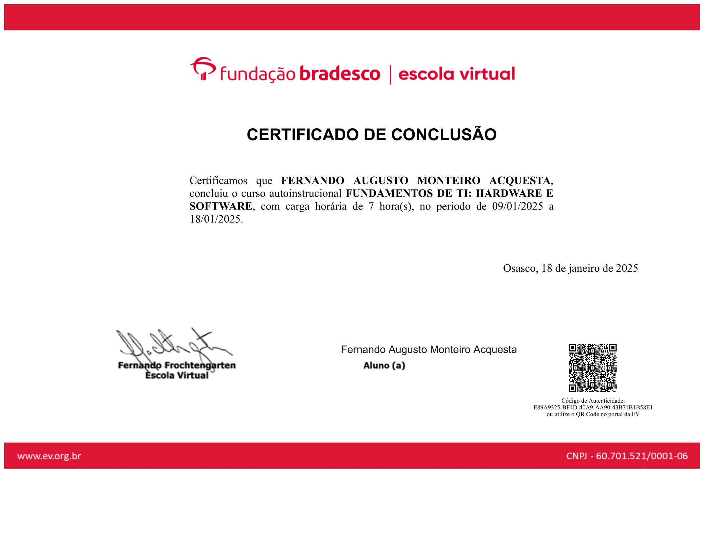

# 🔐 Portfólio de Cibersegurança | Fernando Acquesta

Bem-vindo ao meu portfólio de projetos práticos em **Cibersegurança**!  

Sou estudante de Cibersegurança com foco no desenvolvimento de habilidades técnicas voltadas para proteção de sistemas e dados.  
Tenho experiência prática em **análise de segurança, automação com Python, hardening de sistemas, análise de logs e gestão de vulnerabilidades**, aplicando metodologias reconhecidas no setor.  

Este portfólio reúne projetos que demonstram minha capacidade de aprender, aplicar conceitos e utilizar ferramentas de segurança em cenários reais.

---

## 🎯 Objetivo

Busco oportunidades como **profissional júnior em Cibersegurança**, aplicando e expandindo meus conhecimentos em ambientes reais, contribuindo para a proteção de sistemas e dados.

---

## 🛠️ Tecnologias e Ferramentas

**Linguagens de Automação/Dados:**
- Python 🐍
- Bash/Shell Script
- SQL

**Sistemas Operacionais e Ambientes:**
- Linux (Kali, Ubuntu)
- Windows
- Cloud Security

**Ferramentas Essenciais:**
- Wireshark
- tcpdump
- Análise de Logs (SIEM concepts)

---

## 🛡️ Competências Técnicas

- Análise de Vulnerabilidades (Vulnerability Management)
- **Hardening de Sistemas**
- Gerenciamento de Acessos
- **Inteligência de Ameaças Cibernéticas (Cyber Threat Intelligence)**
- **Resposta e Tratamento de Incidentes (CSIM)**
- Segurança de Redes (Network Security)
- Gestão de Ameaças (Threat Management)

---

## 📂 Projetos em Destaque

### 🔹 [Ticket de Alerta - Resposta a Incidente de Phishing (Security Alert Ticket)](https://github.com/fernando-acq/security-alert-ticket)
Documentação completa de resposta a incidente de phishing com análise forense e contenção de malware.
- **Tecnologias:** SOC Operations, IDS, IoC Analysis, Incident Response, MITRE ATT&CK
- **Objetivo:** Demonstrar resposta estruturada a incidentes de phishing com análise forense
- **Status:** ✅ Completo

### 🔹 [Gerenciamento de Lista de Permissões IP com Python (IP Access Manager)](https://github.com/fernando-acq/ip-access-manager)
Algoritmo em Python para automatizar a remoção de endereços IP não autorizados de arquivos de controle de acesso.
- **Tecnologias:** Python, manipulação de arquivos
- **Objetivo:** Automatizar gerenciamento de acessos restritos
- **Status:** ✅ Completo

### 🔹 [Filtros SQL para Segurança (SQL Security Filters)](https://github.com/fernando-acq/sql-security-filters)
Aplicação de filtros SQL para análise de logs de segurança e investigação de incidentes.
- **Tecnologias:** SQL, MySQL, filtros avançados
- **Objetivo:** Detectar ameaças através de análise de logs e queries de segurança
- **Status:** ✅ Completo

### 🔹 [Permissões de Arquivo no Linux (Linux File Permissions)](https://github.com/fernando-acq/linux-file-permissions)
Gerenciamento de permissões de arquivos e diretórios no Linux com chmod e boas práticas de segurança.
- **Tecnologias:** Linux, Bash, chmod, ls
- **Objetivo:** Aplicar princípio de menor privilégio e controle de acesso em sistemas
- **Status:** ✅ Completo

### 🔹 [Análise de Ataque DoS com Wireshark (Wireshark DoS Attack Analysis)](https://github.com/fernando-acq/wireshark-dos-attack-analysis)
Análise de ataque DoS (SYN Flood) usando Wireshark com relatório completo de incidente.
- **Tecnologias:** Wireshark, TCP/IP, análise de tráfego
- **Objetivo:** Identificar e documentar ataques de rede com medidas de mitigação
- **Status:** ✅ Completo

### 🔹 [Análise DNS com tcpdump (tcpdump DNS Analysis)](https://github.com/fernando-acq/tcpdump-dns-analysis)
Diagnóstico de falha de comunicação DNS (porta 53) usando tcpdump para análise de rede.
- **Tecnologias:** tcpdump, DNS, UDP, ICMP
- **Objetivo:** Diagnosticar e resolver problemas críticos em serviços de rede
- **Status:** ✅ Completo

### 🔹 [Incident Report Analysis - NIST CSF](https://github.com/fernando-acq/incident-report-analysis-nist-csf)
Análise completa de ataque DDoS (ICMP Flood) usando as 5 funções do NIST Cybersecurity Framework.
- **Tecnologias:** NIST CSF, DDoS Analysis, Incident Response, Firewall Configuration
- **Objetivo:** Demonstrar aplicação prática do NIST CSF em resposta estruturada a incidentes
- **Status:** ✅ Completo

### 🔹 [Relatório de Avaliação de Vulnerabilidades (Vulnerability Assessment Report)](https://github.com/fernando-acq/vulnerability-assessment-report)
Relatório de avaliação de vulnerabilidades usando framework NIST SP 800-30 Rev. 1.
- **Tecnologias:** NIST SP 800-30, análise de riscos, matriz de riscos
- **Objetivo:** Identificar vulnerabilidades críticas e propor estratégias de remediação
- **Status:** ✅ Completo

---

## 📜 Certificações

Aqui estão as certificações mais relevantes que comprovam meus conhecimentos em Cibersegurança:

### 🎓 Google Cybersecurity Professional Certificate (Coursera, 2025)

Conjunto de 8 cursos que compõem o programa profissional da Google:

| Curso | Status | Link |
|-------|--------|------|
| Foundations of Cybersecurity | ✅ Concluído | [Ver Certificado](./certificados/foundations-cybersecurity.pdf) |
| Play It Safe: Manage Security Risks | ✅ Concluído | [Ver Certificado](./certificados/manage-security-risks.pdf) |
| Connect and Protect: Networks and Network Security | ✅ Concluído | [Ver Certificado](./certificados/networks-security.pdf) |
| Tools of the Trade: Linux and SQL | ✅ Concluído | [Ver Certificado](./certificados/linux-sql.pdf) |
| Assets, Threats, and Vulnerabilities | ✅ Concluído | [Ver Certificado](./certificados/assets-threats-vulnerabilities.pdf) |
| Sound the Alarm: Detection and Response | ✅ Concluído | [Ver Certificado](./certificados/detection-response.pdf) |
| Automate Cybersecurity Tasks with Python | ✅ Concluído | [Ver Certificado](./certificados/automate-with-python.pdf) |
| Put It to Work: Prepare for Cybersecurity Jobs | ✅ Concluído | [Ver Certificado](./certificados/cybersecurity-jobs.pdf) |

🔗 [Ver Certificado Profissional](./certificados/google-cybersecurity-professional.pdf)

### Cursos Complementares

| Certificação | Instituição | Ano | Link |
|--------------|-------------|-----|------|
| Segurança em Tecnologia da Informação | Fundação Bradesco | 2024 | [Ver Certificado](./certificados/bradesco-seguranca-ti.pdf) |
| Lei Geral de Proteção de Dados (LGPD) | Fundação Bradesco | 2024 | [Ver Certificado](./certificados/bradesco-lgpd.pdf) |
| Fundamentos de TI: Hardware e Software | Fundação Bradesco | 2024 | [Ver Certificado](./certificados/bradesco-fundamentos-ti.pdf) |

---

📎 Visualizar Imagens dos Certificados dos Cursos de Google Cybersecurity Professional Certificate

  
  
  
  
  
  
  
  
  

📎 Visualizar Imagens dos Certificados dos Cursos Complementares

  

  
  
  

---

## 📫 Contato

- 🟦 **LinkedIn:** [fernando-acquesta-cybersecurity](https://www.linkedin.com/in/fernando-acquesta-cybersecurity)
- 📧 **Email:** fernando.acq.monteiro@gmail.com
- 🐙 **GitHub:** [@fernando-acq](https://github.com/fernando-acq)

---

## 📊 Estatísticas do GitHub

---

⭐ **Este portfólio está em constante atualização com novos projetos!**

📌 Última atualização: Fevereiro 2026
